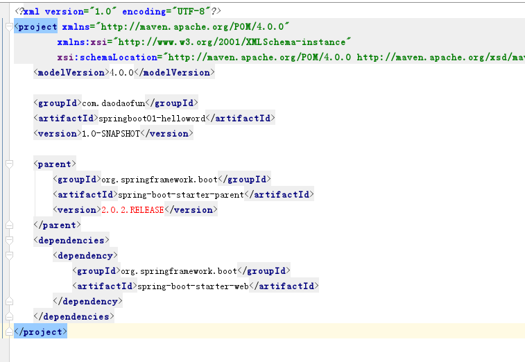
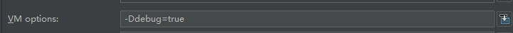
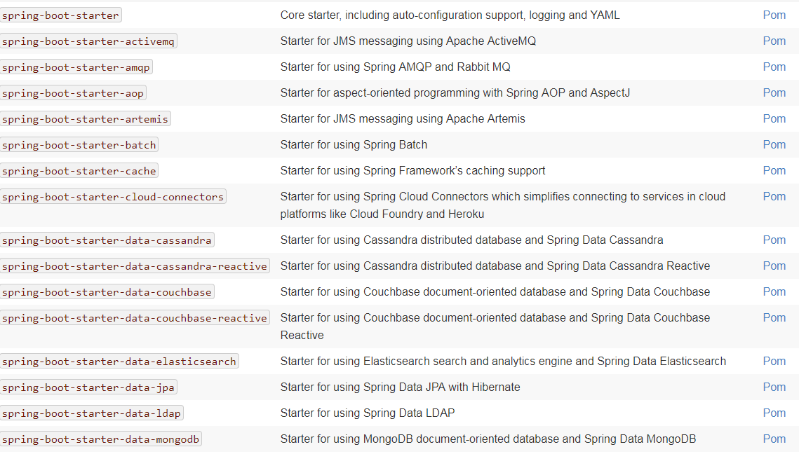
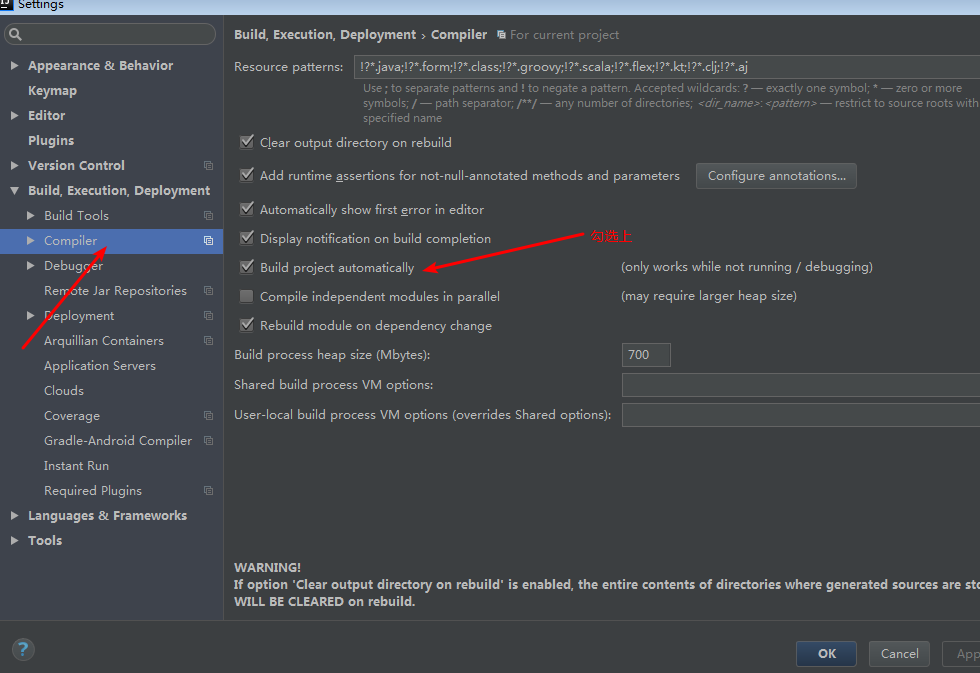
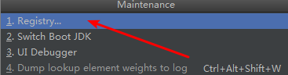
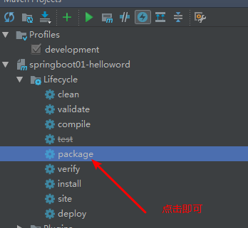
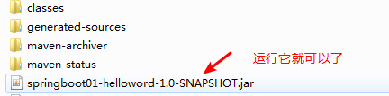
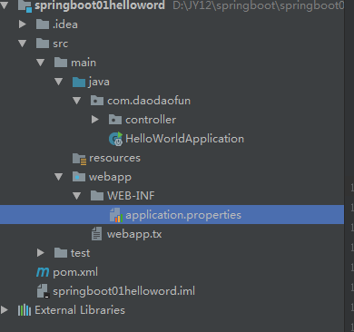
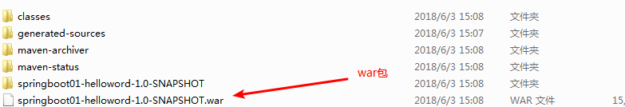
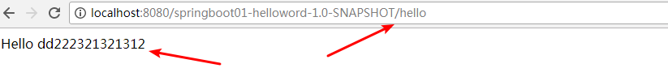

# 道一道Spring Boot

## Spring Boot简介

### Spring Boot起源

Spring Boot是2014年单独分离出一个团队开发的基于Spring的一个快速开发j2ee的框架，你是否受够了那些恶心的配置，希望有一天能够早日解脱，嘿嘿嘿，Spring Boot 就是为此而生啊。

### Spring Boot的目标

- 为所有Spring开发提供一个更快，更广泛的入门体验。
- 立即开始斟酌，但随着需求开始偏离默认值，快速避开。
- 提供大型项目（如嵌入式服务器，安全性，指标，运行状况检查和外部配置）通用的一系列非功能性功能。
- 绝对不会生成代码，并且不需要XML配置。

### 环境要求

- JDK8
- Maven3.5以上(虽然不需要这么高，但是请你和我保持一致)
- STS/idea2018(贫道使用idea2018.1.3，建议与我同步)
- Spring Boot2.0.2

==千言万语，不如下海一试啊，我们走，我们走~流浪法师-瑞兹。==

## HelloWorld入门初体验

### 新建Maven工程


### 修改pom.xml




#### 添加父项目

```xml

    <parent>
        <groupId>org.springframework.boot</groupId>
        <artifactId>spring-boot-starter-parent</artifactId>
        <version>2.0.2.RELEASE</version>
    </parent>
```


#### 添加web引导依赖

```xml
    <dependencies>
        <dependency>
            <groupId>org.springframework.boot</groupId>
            <artifactId>spring-boot-starter-web</artifactId>
        </dependency>
    </dependencies>
```


#### 编写一个核心启动类

```java
package com.daodaofun;

import org.springframework.boot.SpringApplication;
import org.springframework.boot.autoconfigure.SpringBootApplication;
import org.springframework.context.ApplicationContext;


@SpringBootApplication
public class HelloWorldApplication {

    public static void main(String[] args) {
       ApplicationContext ctx = SpringApplication.run(HelloWorldApplication.class,args);
    }

}


```


#### 编写一个Controller

```java
package com.daodaofun.controller;


import org.springframework.stereotype.Controller;
import org.springframework.web.bind.annotation.RequestMapping;
import org.springframework.web.bind.annotation.ResponseBody;

import javax.xml.ws.RequestWrapper;

@Controller
public class HelloController {


    @RequestMapping("/hello")
    @ResponseBody
    public String hello() {

        return "Hello World";
    }

}


```

==注意==，这个包必须在前面配置的启动类的同包或者其子包之下。


#### 启动测试

直接run main方法即可。

访问http:localhost:8080/hello能够返回helloworld 即代表成功。

## 程序分析

### @SpringBootApplication注解

我们可以简单看下它是源码声明：

```java
@SpringBootConfiguration
@EnableAutoConfiguration
@ComponentScan(
    excludeFilters = {@Filter(
    type = FilterType.CUSTOM,
    classes = {TypeExcludeFilter.class}
), @Filter(
    type = FilterType.CUSTOM,
    classes = {AutoConfigurationExcludeFilter.class}
)}
)
public @interface SpringBootApplication {
    
}
```

这里面三个注解的作用分别又是什么呢？

@**SpringBootConfiguration**

它是springboot的一个配置注解，让其具备spring Boot配置能力，而它又被spring的一个底层注解所标注

​	@**Configuration**

​	让一个类具备可配置的能力

@**EnableAutoConfiguration**

看名字就知道所具有某种能力，能力就是自动配置，看到这里我相信就比较明确类，springboot需要配置，只不过所自动配置，而这个自动配置都是由springboot帮我们完成的，我们几乎饭来张口，衣来伸手。

这个注解里面呢：

```java
@AutoConfigurationPackage
@Import(AutoConfigurationImportSelector.class)
public @interface EnableAutoConfiguration
```

可以看到又有两个注解

​	@**AutoConfigurationPackage**

它里面：

```java
@Import(AutoConfigurationPackages.Registrar.class)
public @interface AutoConfigurationPackage 
```

有一个@**Import**

能够将配置类自动配置的包的内容给导入进来，包含等等内容，其实可以看出，springboot的目的就是要将这些细节全部屏蔽，希望开发人员可以尽情地去开展我们地业务。

如果希望了解更为详细，我们可以通过debug的方式，进行观察即可。

### 查看程序启动都注册了什么bean

修改启动类：

```java
  public static void main(String[] args) {
       ApplicationContext ctx = SpringApplication.run(HelloWorldApplication.class,args);
        String[] beanDefinitionNames = ctx.getBeanDefinitionNames();
        for (String beanName : beanDefinitionNames) {
            System.out.println(beanName);
        }
    }
```


在输出打印可以看到：

```log
org.springframework.context.annotation.internalConfigurationAnnotationProcessor
org.springframework.context.annotation.internalAutowiredAnnotationProcessor
org.springframework.context.annotation.internalRequiredAnnotationProcessor
org.springframework.context.annotation.internalCommonAnnotationProcessor
org.springframework.context.event.internalEventListenerProcessor
org.springframework.context.event.internalEventListenerFactory
helloWorldApplication
org.springframework.boot.autoconfigure.internalCachingMetadataReaderFactory
helloController
org.springframework.boot.autoconfigure.AutoConfigurationPackages
org.springframework.boot.autoconfigure.context.PropertyPlaceholderAutoConfiguration
org.springframework.boot.autoconfigure.condition.BeanTypeRegistry
propertySourcesPlaceholderConfigurer
org.springframework.boot.autoconfigure.websocket.servlet.WebSocketServletAutoConfiguration$TomcatWebSocketConfiguration
websocketContainerCustomizer
org.springframework.boot.autoconfigure.websocket.servlet.WebSocketServletAutoConfiguration
org.springframework.boot.autoconfigure.web.servlet.ServletWebServerFactoryConfiguration$EmbeddedTomcat
tomcatServletWebServerFactory
org.springframework.boot.autoconfigure.web.servlet.ServletWebServerFactoryAutoConfiguration
servletWebServerFactoryCustomizer
tomcatServletWebServerFactoryCustomizer
server-org.springframework.boot.autoconfigure.web.ServerProperties
org.springframework.boot.context.properties.ConfigurationPropertiesBindingPostProcessor
org.springframework.boot.context.properties.ConfigurationBeanFactoryMetadata
webServerFactoryCustomizerBeanPostProcessor
errorPageRegistrarBeanPostProcessor
org.springframework.boot.autoconfigure.web.servlet.DispatcherServletAutoConfiguration$DispatcherServletConfiguration
dispatcherServlet
mainDispatcherServletPathProvider
spring.mvc-org.springframework.boot.autoconfigure.web.servlet.WebMvcProperties
org.springframework.boot.autoconfigure.web.servlet.DispatcherServletAutoConfiguration$DispatcherServletRegistrationConfiguration
dispatcherServletRegistration
org.springframework.boot.autoconfigure.web.servlet.DispatcherServletAutoConfiguration
org.springframework.boot.autoconfigure.validation.ValidationAutoConfiguration
defaultValidator
methodValidationPostProcessor
org.springframework.boot.autoconfigure.web.servlet.error.ErrorMvcAutoConfiguration$WhitelabelErrorViewConfiguration
error
beanNameViewResolver
org.springframework.boot.autoconfigure.web.servlet.error.ErrorMvcAutoConfiguration$DefaultErrorViewResolverConfiguration
conventionErrorViewResolver
org.springframework.boot.autoconfigure.web.servlet.error.ErrorMvcAutoConfiguration
errorAttributes
basicErrorController
errorPageCustomizer
preserveErrorControllerTargetClassPostProcessor
spring.resources-org.springframework.boot.autoconfigure.web.ResourceProperties
org.springframework.boot.autoconfigure.web.servlet.WebMvcAutoConfiguration$WebMvcAutoConfigurationAdapter$FaviconConfiguration
faviconHandlerMapping
faviconRequestHandler
org.springframework.boot.autoconfigure.web.servlet.WebMvcAutoConfiguration$EnableWebMvcConfiguration
requestMappingHandlerAdapter
requestMappingHandlerMapping
mvcConversionService
mvcValidator
mvcContentNegotiationManager
mvcPathMatcher
mvcUrlPathHelper
viewControllerHandlerMapping
beanNameHandlerMapping
resourceHandlerMapping
mvcResourceUrlProvider
defaultServletHandlerMapping
mvcUriComponentsContributor
httpRequestHandlerAdapter
simpleControllerHandlerAdapter
handlerExceptionResolver
mvcViewResolver
mvcHandlerMappingIntrospector
org.springframework.boot.autoconfigure.web.servlet.WebMvcAutoConfiguration$WebMvcAutoConfigurationAdapter
defaultViewResolver
viewResolver
welcomePageHandlerMapping
requestContextFilter
org.springframework.boot.autoconfigure.web.servlet.WebMvcAutoConfiguration
hiddenHttpMethodFilter
httpPutFormContentFilter
org.springframework.boot.autoconfigure.jmx.JmxAutoConfiguration
mbeanExporter
objectNamingStrategy
mbeanServer
org.springframework.boot.autoconfigure.context.ConfigurationPropertiesAutoConfiguration
org.springframework.boot.autoconfigure.jackson.JacksonAutoConfiguration$Jackson2ObjectMapperBuilderCustomizerConfiguration
standardJacksonObjectMapperBuilderCustomizer
spring.jackson-org.springframework.boot.autoconfigure.jackson.JacksonProperties
org.springframework.boot.autoconfigure.jackson.JacksonAutoConfiguration$JacksonObjectMapperBuilderConfiguration
jacksonObjectMapperBuilder
org.springframework.boot.autoconfigure.jackson.JacksonAutoConfiguration$ParameterNamesModuleConfiguration
parameterNamesModule
org.springframework.boot.autoconfigure.jackson.JacksonAutoConfiguration$JacksonObjectMapperConfiguration
jacksonObjectMapper
org.springframework.boot.autoconfigure.jackson.JacksonAutoConfiguration
jsonComponentModule
org.springframework.boot.autoconfigure.http.HttpMessageConvertersAutoConfiguration$StringHttpMessageConverterConfiguration
stringHttpMessageConverter
spring.http.encoding-org.springframework.boot.autoconfigure.http.HttpEncodingProperties
org.springframework.boot.autoconfigure.http.JacksonHttpMessageConvertersConfiguration$MappingJackson2HttpMessageConverterConfiguration
mappingJackson2HttpMessageConverter
org.springframework.boot.autoconfigure.http.JacksonHttpMessageConvertersConfiguration
org.springframework.boot.autoconfigure.http.HttpMessageConvertersAutoConfiguration
messageConverters
org.springframework.boot.autoconfigure.http.codec.CodecsAutoConfiguration$JacksonCodecConfiguration
jacksonCodecCustomizer
org.springframework.boot.autoconfigure.http.codec.CodecsAutoConfiguration
org.springframework.boot.autoconfigure.info.ProjectInfoAutoConfiguration
spring.info-org.springframework.boot.autoconfigure.info.ProjectInfoProperties
org.springframework.boot.autoconfigure.security.reactive.ReactiveSecurityAutoConfiguration
spring.security-org.springframework.boot.autoconfigure.security.SecurityProperties
org.springframework.boot.autoconfigure.web.client.RestTemplateAutoConfiguration
restTemplateBuilder
org.springframework.boot.autoconfigure.web.embedded.EmbeddedWebServerFactoryCustomizerAutoConfiguration$TomcatWebServerFactoryCustomizerConfiguration
tomcatWebServerFactoryCustomizer
org.springframework.boot.autoconfigure.web.embedded.EmbeddedWebServerFactoryCustomizerAutoConfiguration
org.springframework.boot.autoconfigure.web.servlet.HttpEncodingAutoConfiguration
characterEncodingFilter
localeCharsetMappingsCustomizer
org.springframework.boot.autoconfigure.web.servlet.MultipartAutoConfiguration
multipartConfigElement
multipartResolver
spring.servlet.multipart-org.springframework.boot.autoconfigure.web.servlet.MultipartProperties
```


### 获取调试日志

如果我们希望更加清楚的看到启动的时候的调试信息，可以添加vm参数

**-Ddebug=true**



启动的时候能看到类似如下的信息：

```
 GenericCacheConfiguration matched:
      - Cache org.springframework.boot.autoconfigure.cache.GenericCacheConfiguration automatic cache type (CacheCondition)

   HttpEncodingAutoConfiguration matched:
      - @ConditionalOnClass found required class 'org.springframework.web.filter.CharacterEncodingFilter'; @ConditionalOnMissingClass did not find unwanted class (OnClassCondition)
      - found ConfigurableWebEnvironment (OnWebApplicationCondition)
      - @ConditionalOnProperty (spring.http.encoding.enabled) matched (OnPropertyCondition)
```


### 传说中的父项目

`spring-boot-starter-parent`是基于引导-Spring应用程序提供的依赖和插件管理父POM。它包含要使用的Java的默认版本，Spring Boot使用的依赖项的默认版本以及Maven插件的默认配置。 

我们可以看看：

```xml
<?xml version="1.0" encoding="UTF-8"?>
<project xmlns="http://maven.apache.org/POM/4.0.0" xmlns:xsi="http://www.w3.org/2001/XMLSchema-instance"
	xsi:schemaLocation="http://maven.apache.org/POM/4.0.0 http://maven.apache.org/xsd/maven-4.0.0.xsd">
	<modelVersion>4.0.0</modelVersion>
	<parent>
		<groupId>org.springframework.boot</groupId>
		<artifactId>spring-boot-dependencies</artifactId>
		<version>${revision}</version>
		<relativePath>../../spring-boot-dependencies</relativePath>
	</parent>
	<artifactId>spring-boot-starter-parent</artifactId>
	<packaging>pom</packaging>
	<name>Spring Boot Starter Parent</name>
	<description>Parent pom providing dependency and plugin management for applications
		built with Maven</description>
	<properties>
		<java.version>1.8</java.version>
		<resource.delimiter>@</resource.delimiter> <!-- delimiter that doesn't clash with Spring ${} placeholders -->
		<project.build.sourceEncoding>UTF-8</project.build.sourceEncoding>
		<project.reporting.outputEncoding>UTF-8</project.reporting.outputEncoding>
		<maven.compiler.source>${java.version}</maven.compiler.source>
		<maven.compiler.target>${java.version}</maven.compiler.target>
	</properties>
	<build>
		<!-- Turn on filtering by default for application properties -->
		<resources>
			<resource>
				<directory>${basedir}/src/main/resources</directory>
				<filtering>true</filtering>
				<includes>
					<include>**/application*.yml</include>
					<include>**/application*.yaml</include>
					<include>**/application*.properties</include>
				</includes>
			</resource>
			<resource>
				<directory>${basedir}/src/main/resources</directory>
				<excludes>
					<exclude>**/application*.yml</exclude>
					<exclude>**/application*.yaml</exclude>
					<exclude>**/application*.properties</exclude>
				</excludes>
			</resource>
		</resources>
		<pluginManagement>
			<plugins>
				<!-- Apply more sensible defaults for user projects -->
				<plugin>
					<groupId>org.jetbrains.kotlin</groupId>
					<artifactId>kotlin-maven-plugin</artifactId>
					<version>${kotlin.version}</version>
					<configuration>
						<jvmTarget>${java.version}</jvmTarget>
						<javaParameters>true</javaParameters>
					</configuration>
					<executions>
						<execution>
							<id>compile</id>
							<phase>compile</phase>
							<goals>
								<goal>compile</goal>
							</goals>
						</execution>
						<execution>
							<id>test-compile</id>
							<phase>test-compile</phase>
							<goals>
								<goal>test-compile</goal>
							</goals>
						</execution>
					</executions>
				</plugin>
			

				<plugin>
					<groupId>org.codehaus.mojo</groupId>
					<artifactId>exec-maven-plugin</artifactId>
					<configuration>
						<mainClass>${start-class}</mainClass>
					</configuration>
				</plugin>
				<plugin>
					<groupId>org.apache.maven.plugins</groupId>
					<artifactId>maven-resources-plugin</artifactId>
					<configuration>
						<delimiters>
							<delimiter>${resource.delimiter}</delimiter>
						</delimiters>
						<useDefaultDelimiters>false</useDefaultDelimiters>
					</configuration>
				</plugin>
				<plugin>
					<groupId>pl.project13.maven</groupId>
					<artifactId>git-commit-id-plugin</artifactId>
					<executions>
						<execution>
							<goals>
								<goal>revision</goal>
							</goals>
						</execution>
					</executions>
					<configuration>
						<verbose>true</verbose>
						<dateFormat>yyyy-MM-dd'T'HH:mm:ssZ</dateFormat>
						<generateGitPropertiesFile>true</generateGitPropertiesFile>
						<generateGitPropertiesFilename>${project.build.outputDirectory}/git.properties</generateGitPropertiesFilename>
					</configuration>
				</plugin>
				<!-- Support our own plugin -->
				<plugin>
					<groupId>org.springframework.boot</groupId>
					<artifactId>spring-boot-maven-plugin</artifactId>
					<executions>
						<execution>
							<goals>
								<goal>repackage</goal>
							</goals>
						</execution>
					</executions>
					<configuration>
						<mainClass>${start-class}</mainClass>
					</configuration>
				</plugin>
				<!-- Support shade packaging (if the user does not want to use our plugin) -->
				<plugin>
					<groupId>org.apache.maven.plugins</groupId>
					<artifactId>maven-shade-plugin</artifactId>
					<configuration>
						<keepDependenciesWithProvidedScope>true</keepDependenciesWithProvidedScope>
						<createDependencyReducedPom>true</createDependencyReducedPom>
						<filters>
							<filter>
								<artifact>*:*</artifact>
								<excludes>
									<exclude>META-INF/*.SF</exclude>
									<exclude>META-INF/*.DSA</exclude>
									<exclude>META-INF/*.RSA</exclude>
								</excludes>
							</filter>
						</filters>
					</configuration>
					<dependencies>
						<dependency>
							<groupId>org.springframework.boot</groupId>
							<artifactId>spring-boot-maven-plugin</artifactId>
							<version>${revision}</version>
						</dependency>
					</dependencies>
					<executions>
						<execution>
							<phase>package</phase>
							<goals>
								<goal>shade</goal>
							</goals>
							<configuration>
								<transformers>
									<transformer
										implementation="org.apache.maven.plugins.shade.resource.AppendingTransformer">
										<resource>META-INF/spring.handlers</resource>
									</transformer>
									<transformer
										implementation="org.springframework.boot.maven.PropertiesMergingResourceTransformer">
										<resource>META-INF/spring.factories</resource>
									</transformer>
									<transformer
										implementation="org.apache.maven.plugins.shade.resource.AppendingTransformer">
										<resource>META-INF/spring.schemas</resource>
									</transformer>
									<transformer
										implementation="org.apache.maven.plugins.shade.resource.ServicesResourceTransformer" />
									<transformer
...
	</build>
</project>
```

可以看到里面定义了部分的version,也定义了很多文件的路径，以及需要扫描的文件，需要注意的是它的上层是spring-boot-dependencie ，截取部分看看：

```xml
		<jdom2.version>2.0.6</jdom2.version>
		<jedis.version>2.9.0</jedis.version>
		<jersey.version>2.27</jersey.version>
		<jest.version>5.3.3</jest.version>
		<jetty.version>9.4.10.v20180503</jetty.version>
		<jetty-jsp.version>2.2.0.v201112011158</jetty-jsp.version>
		<jetty-el.version>8.5.24.2</jetty-el.version>
		<jmustache.version>1.14</jmustache.version>
		<jna.version>4.5.1</jna.version>
		<joda-time.version>2.9.9</joda-time.version>
		<jolokia.version>1.5.0</jolokia.version>
		<johnzon-jsonb.version>1.1.7</johnzon-jsonb.version>
		<jooq.version>3.10.7</jooq.version>
		<jsonassert.version>1.5.0</jsonassert.version>
		<json-path.version>2.4.0</json-path.version>
		<jstl.version>1.2</jstl.version>
		<jtds.version>1.3.1</jtds.version>
		<junit.version>4.12</junit.version>
		<junit-jupiter.version>5.1.1</junit-jupiter.version>
		<junit-platform.version>1.1.0</junit-platform.version>
		<kafka.version>1.1.0</kafka.version>
		<kotlin.version>1.2.41</kotlin.version>
		<lettuce.version>5.1.0.M1</lettuce.version>
		<liquibase.version>3.6.1</liquibase.version>
		<log4j2.version>2.10.0</log4j2.version>
		<logback.version>1.2.3</logback.version>
		<lombok.version>1.16.20</lombok.version>
```


在这里面对大量的版本信息进行了定义。除了这个老爹之外，我们还加入了一个web模块的引导依赖，我们不妨也来看看。

### web模块

```xml

  <parent>
    <groupId>org.springframework.boot</groupId>
    <artifactId>spring-boot-starters</artifactId>
    <version>2.0.2.RELEASE</version>
  </parent>
  <groupId>org.springframework.boot</groupId>
  <artifactId>spring-boot-starter-web</artifactId>
  <version>2.0.2.RELEASE</version>
  <name>Spring Boot Web Starter</name>
  <description>Starter for building web, including RESTful, applications using Spring
		MVC. Uses Tomcat as the default embedded container</description>
  <url>https://projects.spring.io/spring-boot/#/spring-boot-parent/spring-boot-starters/spring-boot-starter-web</url>
  <organization>
    <name>Pivotal Software, Inc.</name>
    <url>https://spring.io</url>
  </organization>
  <licenses>
    <license>
      <name>Apache License, Version 2.0</name>
      <url>http://www.apache.org/licenses/LICENSE-2.0</url>
    </license>
  </licenses>
  <developers>
    <developer>
      <name>Pivotal</name>
      <email>info@pivotal.io</email>
      <organization>Pivotal Software, Inc.</organization>
      <organizationUrl>http://www.spring.io</organizationUrl>
    </developer>
  </developers>
  <scm>
    <connection>scm:git:git://github.com/spring-projects/spring-boot.git/spring-boot-starters/spring-boot-starter-web</connection>
    <developerConnection>scm:git:ssh://git@github.com/spring-projects/spring-boot.git/spring-boot-starters/spring-boot-starter-web</developerConnection>
    <url>http://github.com/spring-projects/spring-boot/spring-boot-starters/spring-boot-starter-web</url>
  </scm>
  <issueManagement>
    <system>Github</system>
    <url>https://github.com/spring-projects/spring-boot/issues</url>
  </issueManagement>
  <dependencies>
    <dependency>
      <groupId>org.springframework.boot</groupId>
      <artifactId>spring-boot-starter</artifactId>
      <version>2.0.2.RELEASE</version>
      <scope>compile</scope>
    </dependency>
    <dependency>
      <groupId>org.springframework.boot</groupId>
      <artifactId>spring-boot-starter-json</artifactId>
      <version>2.0.2.RELEASE</version>
      <scope>compile</scope>
	...
    <dependency>
      <groupId>org.springframework</groupId>
      <artifactId>spring-webmvc</artifactId>
      <version>5.0.6.RELEASE</version>
      <scope>compile</scope>
    </dependency>
  </dependencies>
</project>

```

主要加入来web模块开发必须的依赖，也加入来数据验证等功能，从这么一个简单的分析不难看出，springboot需要我们自己主动为框架做的事情真的很少很少了。

前面我们说过大量的版本号都在spring 的dependencies项目中的pom.xml中已经指定，如果有冲突，我需要发生改变默认的版本号怎么办？

### properties覆盖策略

可以`properties`在项目`pom.xml`文件的标记中覆盖您选择的版本或项目需求。 

比如我想覆盖jackson的版本，在你的项目pom.xml当中覆盖即可。

## starter模板



通过starer模板我们可以看出，如果我们需要继承某项技术，直接引入对应的starer模块即可。

接下来，我们介绍一个使用的工具，类似于热部署，当我们的代码发生改变的时候希望能够及时生效，如果你有等待一个人，哦不一个项目几分钟没反应的经历，你一定很喜欢下面的功能。

## 开发者工具

spring-boot-devtools ，在pom.xml当中添加依赖

```xml
<!--开发者工具-->
<dependency>
    <groupId>org.springframework.boot</groupId>
    <artifactId>spring-boot-devtools</artifactId>
    <optional>true</optional>
</dependency>
```

在plugins立马添加plugin

```xml
<plugin>
    <groupId>org.springframework.boot</groupId>
    <artifactId>spring-boot-maven-plugin</artifactId>
    <configuration>
        <fork>true</fork><!-- 如果没有该项配置，肯呢个devtools不会起作用，即应用不会restart -->
    </configuration>
</plugin>
```

对于idea还要进行额外的设置：




别急还有一步：

ctrl + shift + alt + /




这样你修改代码，基本上2-3秒就是有反应的了。

当然这个开发工具还有很多细节都可以配置，目前我们先了解这么多够用了。

试想一下以前我们开发web项目怎么做的呢？

打一个war包，丢到tomcat，启动。

看Spring Boot有多简单吧




在target下有




我们进入它的目录，然后执行命令即可。

```bash
java -jar springboot01-helloword-1.0-SNAPSHOT.jar
```

关闭这个窗口，项目就停掉了。

### 项目根路径问问题

我们访问项目的时候一直使用的就是/ ,并没有使用任何项目名，这里要注意，可不可以配置，肯定可以，暂时我们都以 /来玩，先别那么复杂。


### tomcat去哪了

对于SpringBoot而言，它已经帮助我们内置嵌入了Tomcat，所以我们无需关心这个问题了。

当然你非要搞个war包像传统方式一样也是可以的。

#### 修改pom.xml

```xml
<?xml version="1.0" encoding="UTF-8"?>
<project xmlns="http://maven.apache.org/POM/4.0.0"
         xmlns:xsi="http://www.w3.org/2001/XMLSchema-instance"
         xsi:schemaLocation="http://maven.apache.org/POM/4.0.0 http://maven.apache.org/xsd/maven-4.0.0.xsd">
    <modelVersion>4.0.0</modelVersion>

    <groupId>com.daodaofun</groupId>
    <artifactId>springboot01-helloword</artifactId>
    <version>1.0-SNAPSHOT</version>
    <packaging>war</packaging>

    <parent>
        <groupId>org.springframework.boot</groupId>
        <artifactId>spring-boot-starter-parent</artifactId>
        <version>2.0.2.RELEASE</version>
    </parent>
    <dependencies>
        <dependency>
            <groupId>org.springframework.boot</groupId>
            <artifactId>spring-boot-starter-web</artifactId>
        </dependency>

        <dependency>
            <groupId>org.springframework.boot</groupId>
            <artifactId>spring-boot-starter-tomcat</artifactId>
            <!--范围声明为提供-->
            <scope>provided</scope>
        </dependency>

        <!--添加servlet依赖-->
        <dependency>
            <groupId>javax.servlet</groupId>
            <artifactId>javax.servlet-api</artifactId>
            <version>3.1.0</version>
            <scope>provided</scope>
        </dependency>
        <dependency>
            <groupId>org.apache.tomcat</groupId>
            <artifactId>tomcat-servlet-api</artifactId>
            <version>8.0.36</version>
            <scope>provided</scope>
        </dependency>
        <!--开发者工具-->
        <dependency>
            <groupId>org.springframework.boot</groupId>
            <artifactId>spring-boot-devtools</artifactId>
            <optional>true</optional>
        </dependency>
    </dependencies>

    <build>

        <plugins>
            <plugin>
                <groupId>org.springframework.boot</groupId>
                <artifactId>spring-boot-maven-plugin</artifactId>
            </plugin>
            <plugin>
                <groupId>org.springframework.boot</groupId>
                <artifactId>spring-boot-maven-plugin</artifactId>
                <configuration>
                    <fork>true</fork><!-- 如果没有该项配置，肯呢个devtools不会起作用，即应用不会restart -->
                </configuration>
            </plugin>
        </plugins>
    </build>
</project>
```

#### 修改启动类

```java
package com.daodaofun;

import org.springframework.boot.SpringApplication;
import org.springframework.boot.autoconfigure.SpringBootApplication;
import org.springframework.boot.web.servlet.support.SpringBootServletInitializer;
import org.springframework.context.annotation.PropertySource;


@SpringBootApplication
@PropertySource("WEB-INF/application.properties")
public class HelloWorldApplication  extends SpringBootServletInitializer{

    public static void main(String[] args) {
        SpringApplication.run(HelloWorldApplication.class,args);
    }


}

```

项目结构如下：



接着

mvn clean

mvn install





我们丢到tomcat里面来试试，注意要8.5哦。

访问成功。




